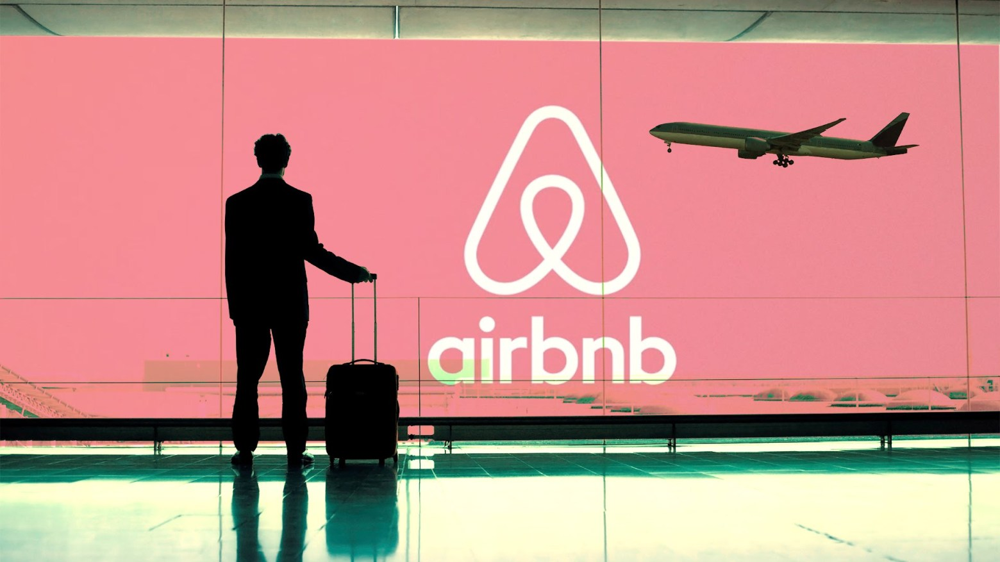

# Kaggle Competition

&nbsp;

# Objetivo

El objetivo de esta competición ha sido predecir el precio de los alojamientos en Amsterdam con modelos de Machine Learning y ver cual de ellos se ajusta mejor. 

&nbsp;
# Datos

Los datos proporcionados han sido las caracterísiticas de cada alojamiento, como habitaciones, locaclización, tipo de vivienda, etc. 
Se encuentran en el [link](https://www.kaggle.com/c/airbnb-madrid-ironhack/overview).

&nbsp;
# Modelos ML
* Regresión lineal múltiple
* Random Forest Regressor
* Extreme Gradient Boosting
* Catboost

&nbsp;
# Librerías
- [Pandas](https://pandas.pydata.org/docs/)
- [Matplotlib](https://matplotlib.org/)
- [Numpy](https://numpy.org/doc/stable/reference/)
- [Seaborn](https://seaborn.pydata.org/)
- [Sklearn](https://scikit-learn.org/stable/)
- [Catboost](https://catboost.ai/en/docs/)

